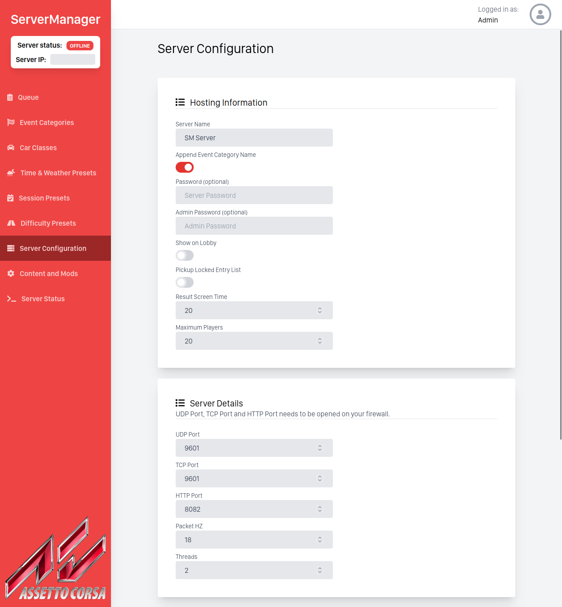
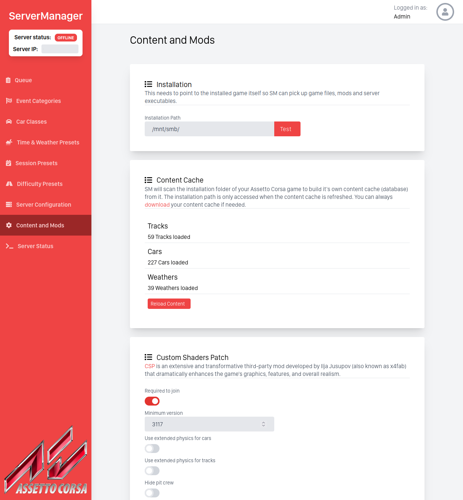
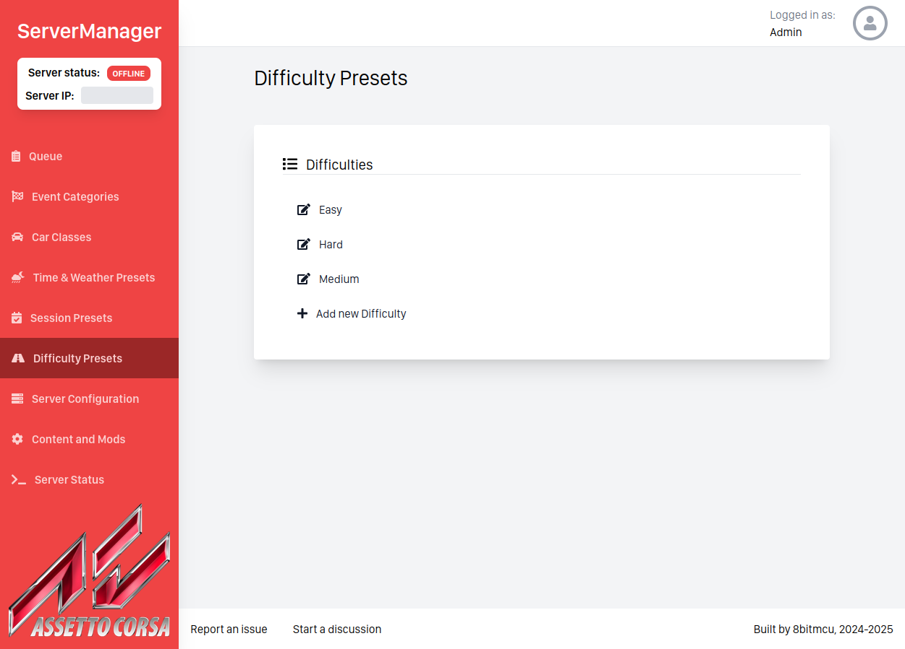
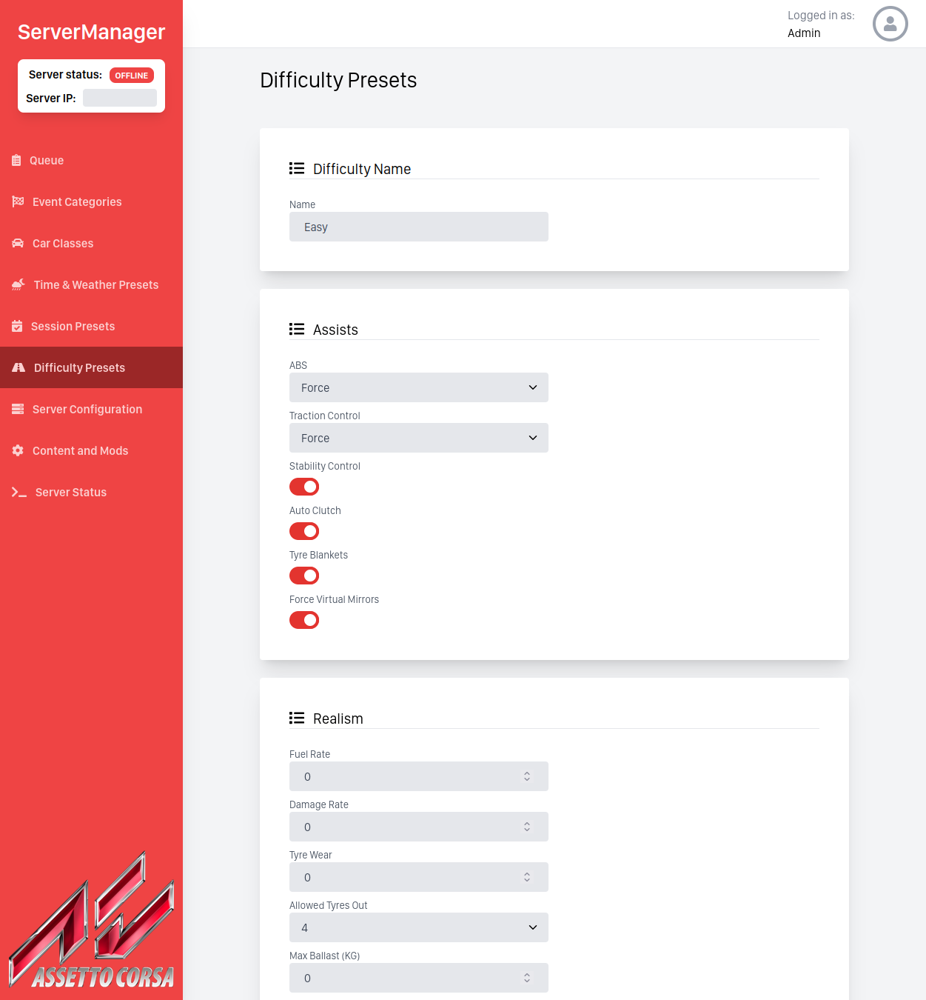
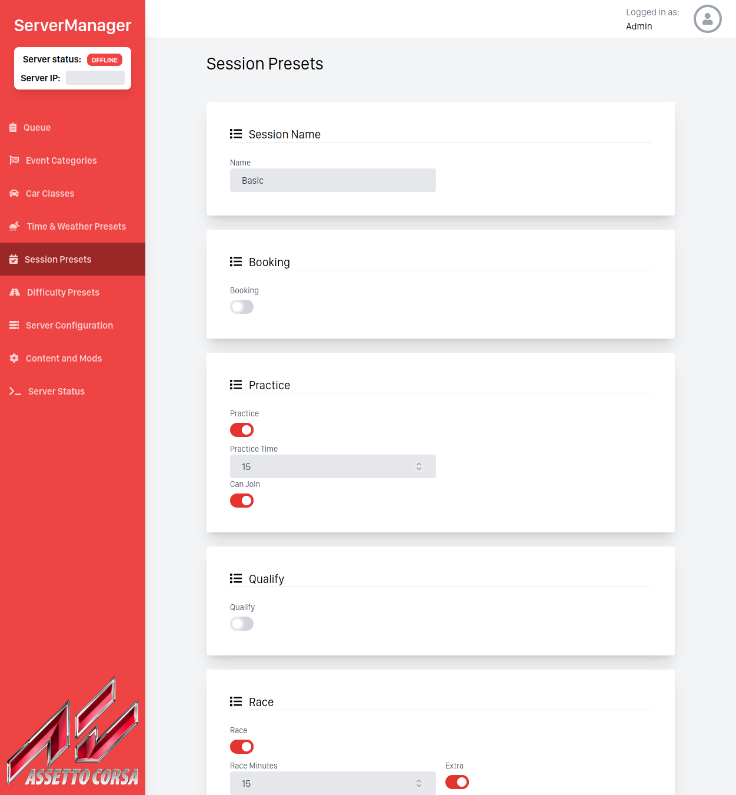
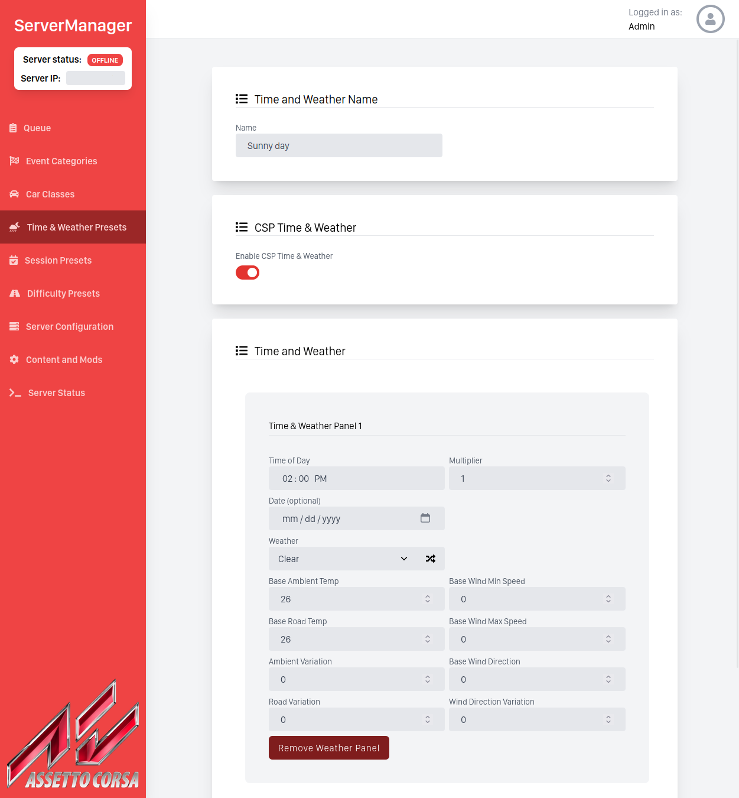
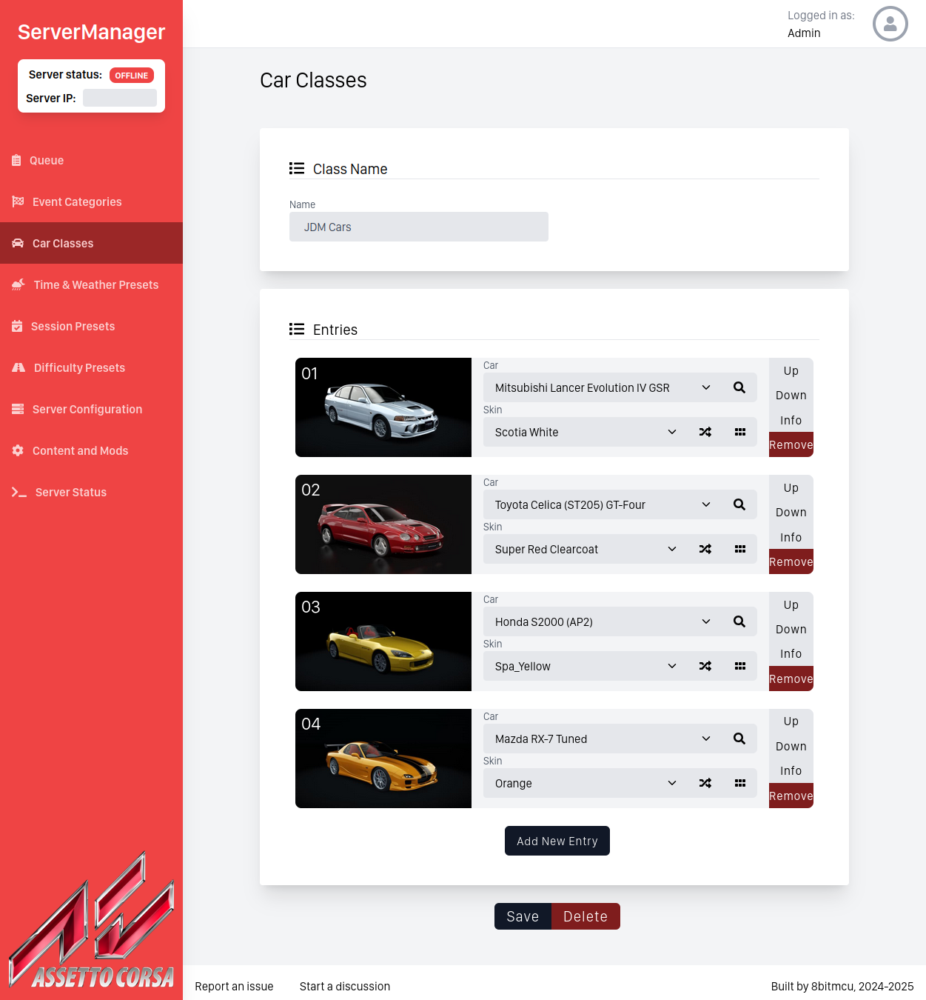

# Server Manager (SM)


SM is a very flexible web interface used to manage a dedicated Assetto Corsa server. With SM, everything is a preset and can be re-used: cars, weather patterns, sessions and difficulty.

Features:

 - Supports CSP ([Custom Shaders Patch](https://acstuff.club/patch/))
 - Supports both Windows and Linux
 - No installation required

To be added:
 - Support for UDP Plugins

# How to use

- Launch the compiled or [pre-built](https://github.com/8bitmcu/ServerManager/releases) executable
- If a browser tab did not appear, manually navigate to http://localhost:3030
- Log in with the username `admin` and password `admin`
- Fill in the Server Configuration page. Some defaults have been provided
    * Remember to open the TCP, UDP and HTTP Ports in your firewall or modem
    * Do not open the web ui's 3030 port
- Follow the instructions on the Content and Mods page
- Create, in any order, at least one difficulty preset, one session preset, one time & weather preset and one car class
- Create a new Event Category with at least one Event
- In the Queue page, add at least one Event to the Queue
- You can now start the server. You can monitor the server from the Server Status page


## Running on Linux

### Prebuilt binaries

Use the pre-built binaries provided in the release tab.

### Dockerfile

The following instructions will build and run the application using the Dockerfile

1. Clone the repository locally
2. cd in the directory and build the Dockerfile
3. Run the application in Docker
4. Acceess the Web UI using http://localhost:3030

```sh
git clone https://github.com/8bitmcu/ServerManager.git
cd ServerManager
docker build . --tag 'servermanager'
docker run --network=host 'servermanager' -v /path/to/corsa:/corsa
```

### Docker compose

1. Clone the repository locally
2. cd into the directory and run `docker compose up`
3. Access the Web UI using https://localhost:443, http://localhost:80 or http://localhost:3030

## Running on Windows

Use the pre-built binaries provided in the release tab.

## Building the project

The project depends on tailwindcss to generate `/css/main.css`, and go-assets-builder to generate `assets.go`. npm is required for tailwindcss.
Run the following to install the dependencies

```sh
make deps
```

### Compiling for Linux

It is best to use the included Makefile to generate a build

```sh
make build
```

### Cross-compile for Windows

The makefile provides an easy to use method to create a build for Windows

```
make buildwin
```

# Screenshots














